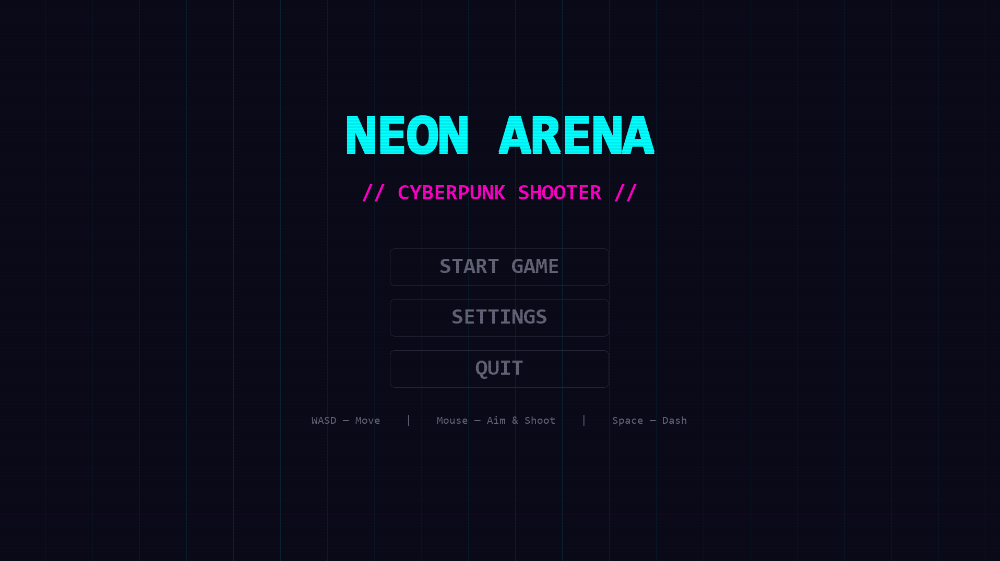
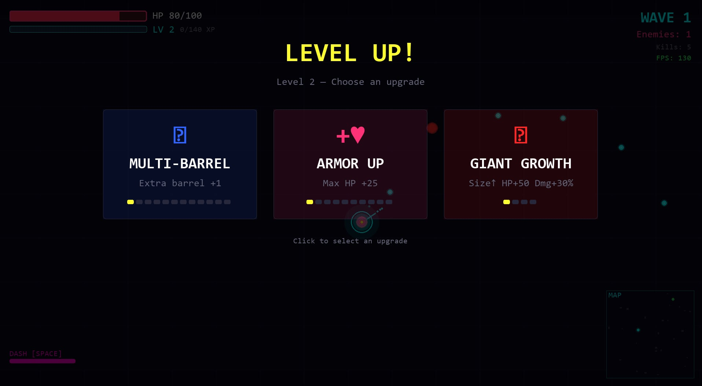
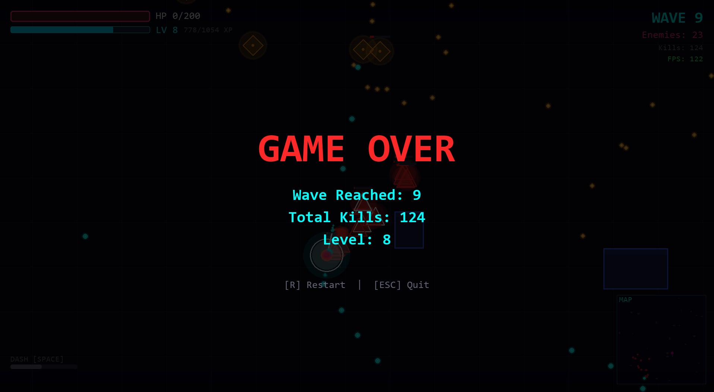

<p align="center">
  
</p>

<h1 align="center">⚡ NEON ARENA ⚡</h1>

<p align="center">
  <strong>A Cyberpunk Arena Shooter</strong><br/>
  <em>Survive the neon-lit arena. Obliterate waves of enemies. Become unstoppable.</em>
</p>

<p align="center">
  
  
  
  
</p>

---

## 🎮 About the Game

**Neon Arena** is a fast-paced, wave-based top-down shooter set in a glowing cyberpunk arena. Fight through endless waves of neon-themed enemies — from relentless Chasers to devastating Bosses — while leveling up and unlocking a deep tree of powerful upgrades.

Every wave pushes the difficulty higher. Every level-up gives you a choice. How long can you survive?

---

## 📸 Screenshot






---

## 🚀 How to Play

### Option 1: Download the Release (Recommended)

1. Go to the [**Releases**](../../releases) section of this repository.
2. Download the latest `.zip` file.
3. Extract the archive.
4. Run **`NeonArena.exe`** — no installation required!

> 💡 **No Python installation needed.** The `.exe` release is fully self-contained.

### Option 2: Run from Source

If you prefer to run from source code:

```bash
# Clone the repository
git clone https://github.com/your-username/Neon-Arena.git
cd Neon-Arena

# Install dependencies
pip install pygame numpy

# Run the game
python main.py
```

---

## 🕹️ Controls

| Action | Input |
|:---|:---|
| **Move** | `W` `A` `S` `D` or `↑` `←` `↓` `→` Arrow Keys |
| **Shoot** | `Mouse Left Click` (hold to auto-fire) |
| **Aim** | Mouse cursor |
| **Dash** | `Space` (in movement direction) |
| **Pause / Menu** | `Esc` |
| **Restart** | `R` (when paused or game over) |

---

## ✨ Key Features

### ⚔️ Combat & Survival
- **Wave-based survival** — Endless waves of enemies with increasing difficulty
- **Boss fights every 5 waves** — Face one of three epic boss types:
  - 🔴 **Original Boss** — Charges, slams AOE attacks, summons minions
  - 🔵 **Sniper Boss** — Keeps distance, fires high-speed lasers & 360° Ring of Death
  - 🟢 **Slime Boss** — Leaves toxic trails, leaps across the arena with devastating shockwaves
- **Diverse enemy roster** — Chasers, Shooters (with fan-shot), and shielded Tanks

### 🔧 Deep Upgrade System
Level up by defeating enemies and choose from **11 unique upgrades**:

| Upgrade | Effect |
|:---|:---|
| ⚡ Rapid Fire | Fire rate +20% per level |
| 🔵 Velocity | Bullet speed +15% per level |
| 💗 Armor Up | Max HP +25 per level |
| 🟠 Overcharge | Damage +20% per level |
| 🟢 Adrenaline | Move speed +10% per level |
| 🟣 Phase Shift | Dash cooldown -15% per level |
| 🔴 Giant Growth | Size↑, HP+50, Damage+30% per level |
| 🔵 Multi-Barrel | Extra barrel +1 (up to 12 — full 360° spray!) |
| 🟠 Ghost Dash | Leave a damaging fire trail when dashing |
| 🟣 Shockwave | Blast enemies at the end of each dash |
| ⚪ Reflex Dash | Dash through bullets for a fire-rate boost |

### 🎆 Visual & Polish
- **Neon cyberpunk aesthetic** — Glowing particles, pulsing auras, and vibrant colors
- **Per-enemy visual identity** — Triangles, diamonds, hexagons, octagons, and blobs
- **Dynamic particle system** — Explosions, trails, sparks, and shockwave rings
- **Power-ups** — Health, Shield, Double Damage, and Speed Boost pickups
- **Mini-map** with real-time tracking of all entities
- **Native resolution rendering** — Crisp visuals at any display resolution

---

## 🏗️ Project Structure

```
Neon-Arena/
├── main.py                  # Entry point
├── arena_shooter/
│   ├── game.py              # Game state machine & main loop
│   ├── player.py            # Player movement, shooting, upgrades
│   ├── enemies.py           # Chaser, Shooter, Tank, Boss, SniperBoss, SlimeBoss
│   ├── enemy_manager.py     # Wave spawning & difficulty scaling
│   ├── projectiles.py       # Bullet classes
│   ├── particles.py         # Neon particle effects system
│   ├── camera.py            # Camera with smooth follow
│   ├── obstacles.py         # Arena obstacles & power-up manager
│   ├── settings.py          # All game constants & configuration
│   ├── settings_menu.py     # In-game settings UI
│   ├── ui.py                # HUD, menus, mini-map, boss bars
│   └── config.py            # Display & audio config persistence
├── settings.json            # User settings (auto-generated)
├── assets/
│   ├── icons/
│   │   └── neonarena.ico        # Application icon
│   ├── images/
│   │   ├── mainmenu.png         # Main menu screenshot
│   │   ├── gameplay1.jpg        # Gameplay screenshot
│   │   ├── levelup.jpg          # Level-up screenshot
│   │   └── end.jpg              # Game-over screenshot
│   └── sounds/
│       ├── sfx/                 # Sound effects (.wav / .ogg)
│       └── music/               # Background music (.ogg / .mp3)
├── NeonArena.spec           # PyInstaller build spec
└── build_app.py             # Build script for .exe distribution
```

---

## 🛠️ Tech Stack

| Technology | Purpose |
|:---|:---|
| **Python 3.x** | Core language |
| **Pygame 2.x** | Game engine, rendering, input, audio |
| **NumPy** | Procedural sound generation |
| **PyInstaller** | Packaging into standalone `.exe` |

---

## 📋 System Requirements

- **OS:** Windows 10/11 (for `.exe` release)
- **Display:** 1280×720 minimum (supports higher resolutions)
- **Input:** Keyboard + Mouse

---

## 👨‍💻 Credits

| Role | Name |
|:---|:---|
| **Developer** | Hoang Le Thanh Duc |
| **Engine** | [Pygame](https://www.pygame.org/) |

---

## 📄 License

This project is open source. Feel free to use, modify, and distribute.

---

<p align="center">
  <strong>⚡ Enter the arena. Survive the neon. ⚡</strong>
</p>
